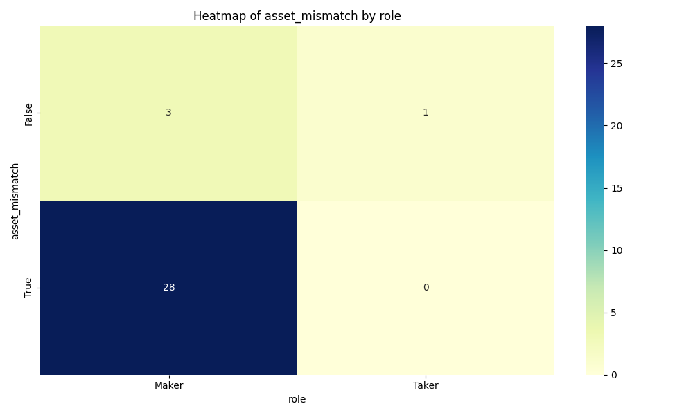

# BHFT Interview Task
[](https://github.com/psf/black)

Test task for the position of [QA Analyst in Algorithmic Trading](https://geekjob.ru/company/62e009541534b2e76202ba79)

## Description
This project is designed to analyze platform and exchange fees to identify discrepancies.
The project includes two main stages: comparing fee data and identifying discrepancies.

## Project structure

```
fee_analysis_project/
├── data/ # Input data
│ ├── own_trade_log.csv
│ ├── order_log.csv
│ ├── dump_log.csv # Hidden due to large size
├── output/ # Output data
│ ├── _fee_comparison.csv
│ ├── _mismatched_data.csv
├── scripts/ # Data Processing Scripts
│ ├── data_analysis.py
│ ├── inconsistency_detection.py
├── README.md # Project Description
└── requirements.txt # Project Dependencies
```

### Input data (`data/`)

1. **own_trade_log.csv**  
   Platform trade log containing information about fees, IDs and assets.

2. **order_log.csv**  
   Order log containing all orders placed on the exchange.

3. **dump_log.csv**  
   Exchange log containing detailed messages about trades.

### Output data (`output/`)

1. **commission_comparison.csv**  
   Results of comparison of platform and exchange fees.

2. **mismatched_data.csv**  
   Results of discrepancy analysis, including information about asset types and the size of the discrepancy.


## Getting Started

### Installing 
1. Clone the repository:
```
git clone https://github.com/YuryHerasimau/fee_analysis_project.git
```
2. Install the required dependencies:
```
pip install -r requirements.txt
``` 

### Usage
1. Commission comparison (creating `commission_comparison.csv`). To run, use the `data_analysis.py` script:
```
python scripts/data_analysis.py
```

2. Detecting discrepancies (creating `mismatched_data.csv`). To run, use the `inconsistency_detection.py` script:
```
python scripts/inconsistency_detection.py
```

## Results

### Summary of Mismatched Data
Below is a summary of discrepancies identified during the analysis:

* Total mismatched rows: 195
* Breakdown by mismatch type:
   * `fee_mismatch`: 134 cases
   * `asset_mismatch`: 133 cases
   * `gt_fee_mismatch`: 92 cases
   * `gt_asset_mismatch`: 86 cases

**Top Contributing Features to Mismatches**

The features with the highest influence on mismatches are:
* `side`
* `is_fee_evaluated`
* `source`

### Visualizations
Also created visualizations to understand the influence of these features.

Example 1: Histogram of `fee_mismatch` by `is_fee_evaluated`


Example 2: Heatmap of `asset_mismatch` by `role`



## What can be improved
- [X] Include `gt_fee` from `dump_log` in fee comparison
- [X] Filter `dump_log` by key parameters
- [X] Enable `order_log` analysis to check order statuses
- [X] Enable `is_fee_evaluated` analysis to understand trading context
- [X] Enable `source` analysis to understand trading context
- [ ] Use `chunking` in pandas to work with large files
- [ ] Add error handling
- [ ] Use `logging` to inform about operation execution instead of `print`
- [ ] Add tests
